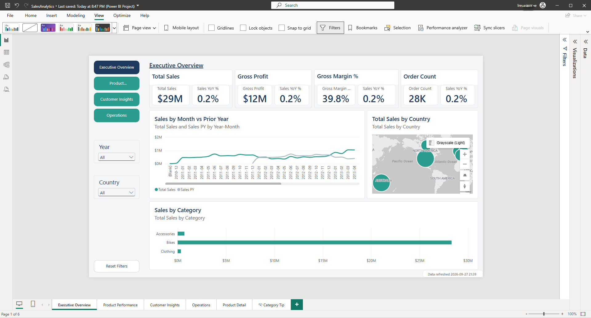
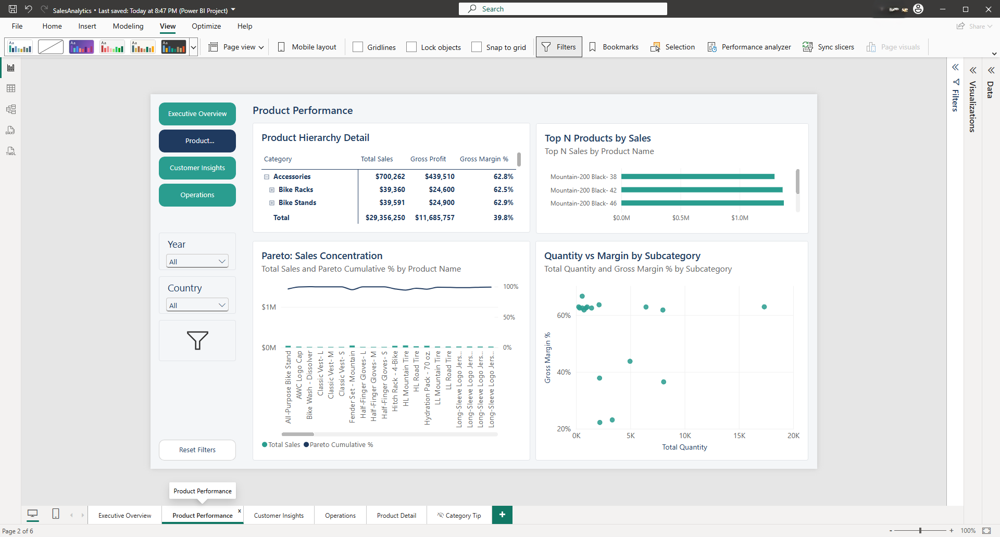
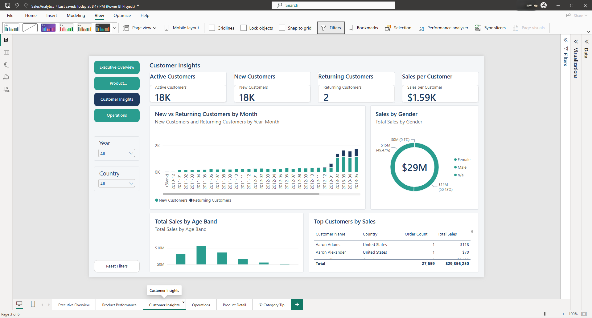
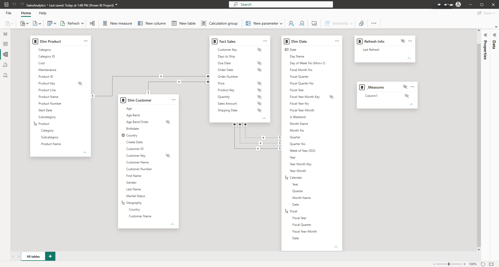
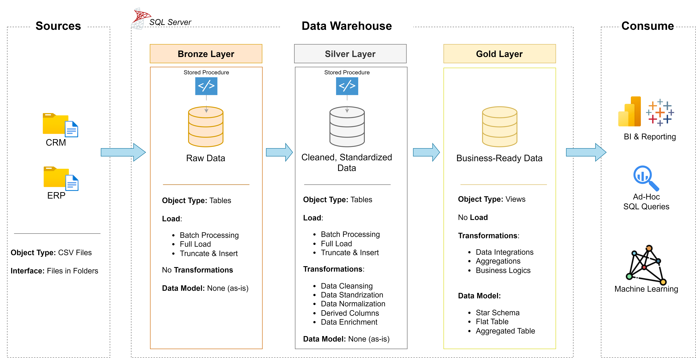

# Data Warehouse and Analytics Project

Welcome to the **Data Warehouse and Analytics Project** repository! 🚀  
This project demonstrates a comprehensive data warehousing and analytics solution, from building a data warehouse to generating actionable insights. Designed as a portfolio project, it highlights industry best practices in data engineering and analytics.

---
## 📖 Project Overview

This project involves:

1. **Data Architecture**: Designing a Modern Data Warehouse Using Medallion Architecture **Bronze**, **Silver**, and **Gold** layers.
2. **ETL Pipelines**: Extracting, transforming, and loading data from source systems into the warehouse.
3. **Data Modeling**: Developing fact and dimension tables optimized for analytical queries.
4. **Analytics & Reporting**: Creating SQL-based reports and dashboards for actionable insights, plus a full Power BI semantic model and interactive report (see below).

🎯 This repository is an excellent resource for professionals and students looking to showcase expertise in:
- SQL Development
- Data Architect
- Data Engineering  
- ETL Pipeline Developer  
- Data Modeling  
- Data Analytics  

---

## 📊 Power BI Sales Analytics Report

A full Power BI semantic model and 6-page interactive report built on top of this warehouse's Gold
layer — turning the star schema into drillable, filterable sales analytics with row-level security.



**Architecture:** CSV (ERP, CRM) → Bronze → Silver → Gold (star schema) → Power BI semantic model → Report

### Report gallery

| Page | Preview |
|---|---|
| Executive Overview |  |
| Product Performance |  |
| Customer Insights |  |
| Operations |  |

### Model



Star schema: `Fact Sales` at the center, joined to `Dim Customer`, `Dim Product`, and `Dim Date` (5
relationships — Order Date is active; Shipping Date and Due Date are inactive, switched in via
`USERELATIONSHIP` for ship-date measures). Full table/relationship list:
[`docs/data_catalog.md`](docs/data_catalog.md#power-bi-semantic-model).

### Measures

30+ DAX measures across base aggregations, customer analytics, calendar and fiscal time
intelligence, operations, and ranking. Five representative ones:

**Total Sales**
```DAX
SUM ( 'Fact Sales'[Sales Amount] )
```

**Gross Margin %**
```DAX
DIVIDE ( [Gross Profit], [Total Sales] )
```

**Sales YoY %**
```DAX
DIVIDE ( [Total Sales] - [Sales PY], [Sales PY] )
```

**Top N Sales**
```DAX
VAR _n = [Top N Value]
RETURN IF ( [Product Rank] <= _n, [Total Sales] )
```

**New Customers**
```DAX
VAR _minDate = MIN ( 'Dim Date'[Date] )
VAR _maxDate = MAX ( 'Dim Date'[Date] )
VAR _custFirst =
    ADDCOLUMNS (
        VALUES ( 'Fact Sales'[Customer Key] ),
        "@FirstOrder", CALCULATE ( MIN ( 'Fact Sales'[Order Date] ), REMOVEFILTERS ( 'Dim Date' ) )
    )
RETURN
    COUNTROWS ( FILTER ( _custFirst, [@FirstOrder] >= _minDate && [@FirstOrder] <= _maxDate ) )
```

Full catalog: [`docs/powerbi_measures.md`](docs/powerbi_measures.md).

### Security

Three static row-level security roles filter `Dim Customer[Country]`: `North America` (United
States, Canada), `Europe` (Germany, United Kingdom, France), `Pacific` (Australia) — tested via
*Modeling → View as* (see [`docs/powerbi_qa_checklist.md`](docs/powerbi_qa_checklist.md)):


**Production extension (not built):** a dynamic RLS pattern using a `Security User Country` bridge
table and `USERPRINCIPALNAME()` to map signed-in users to allowed countries automatically, instead
of manually assigning users to static roles in the Service.

### How to run

1. Load the warehouse:
   ```sql
   EXEC bronze.load_bronze @dataset_path = '<your path>\datasets';
   EXEC silver.load_silver;
   ```
2. Open `powerbi/SalesAnalytics.pbip` in Power BI Desktop (2.157.1354.0 64-bit, August 2026, or later).
3. In *Transform data → Manage Parameters*, set `ServerName`, `DatabaseName`, and
   `FiscalYearStartMonth` (7 = fiscal year starts in July) to match your environment.
4. Refresh.

### Skills demonstrated

| Skill area | Where it shows up |
|---|---|
| Prepare data | Power Query parameters, type transforms, fiscal-year calculated columns |
| Model data | Star schema (1 fact, 4 dimensions), 5 relationships incl. 2 inactive `USERELATIONSHIP` paths, marked date table, hierarchies, sort-by columns |
| DAX | 30+ measures incl. time intelligence, RANKX ranking, Pareto cumulative %, a calculation group, a field parameter |
| Visualize | 6 report pages incl. drill-through, report-page tooltip, bookmarks, synced slicers, mobile layout |
| Secure & deploy | 3 static RLS roles tested via View as; dynamic RLS documented as a production extension |
| Optimize | Performance Analyzer pass ([`docs/powerbi_performance.md`](docs/powerbi_performance.md)) — every visual under 1s |

### Data notes

2013 accounts for 87% of all sales lines (52,782 of 60,398), so any 2013-vs-2012 YoY comparison
shows outsized growth — a property of the sample dataset, not a modeling error. 19 sales lines have
an invalid/blank order date (excluded from year-over-year breakdowns, included in "all data"
totals); every fact row has a valid customer and product key, so there are zero orphan lines. Full
baseline: [`docs/powerbi_reconciliation_results.md`](docs/powerbi_reconciliation_results.md).

---

## 🛠️ Important Links & Tools:

Everything is for Free!
- **[Datasets](datasets/):** Access to the project dataset (csv files).
- **[SQL Server Express](https://www.microsoft.com/en-us/sql-server/sql-server-downloads):** Lightweight server for hosting your SQL database.
- **[SQL Server Management Studio (SSMS)](https://learn.microsoft.com/en-us/sql/ssms/download-sql-server-management-studio-ssms?view=sql-server-ver16):** GUI for managing and interacting with databases.
- **[Git Repository](https://github.com/):** Set up a GitHub account and repository to manage, version, and collaborate on your code efficiently.
- **[DrawIO](https://www.drawio.com/):** Design data architecture, models, flows, and diagrams.
- **[Notion](https://www.notion.com/):** All-in-one tool for project management and organization.
- **[Notion Project Steps](https://thankful-pangolin-2ca.notion.site/SQL-Data-Warehouse-Project-16ed041640ef80489667cfe2f380b269?pvs=4):** Access to All Project Phases and Tasks.

---

## 🚀 Project Requirements

### Building the Data Warehouse (Data Engineering)

#### Objective
Develop a modern data warehouse using SQL Server to consolidate sales data, enabling analytical reporting and informed decision-making.

#### Specifications
- **Data Sources**: Import data from two source systems (ERP and CRM) provided as CSV files.
- **Data Quality**: Cleanse and resolve data quality issues prior to analysis.
- **Integration**: Combine both sources into a single, user-friendly data model designed for analytical queries.
- **Scope**: Focus on the latest dataset only; historization of data is not required.
- **Documentation**: Provide clear documentation of the data model to support both business stakeholders and analytics teams.

---

### BI: Analytics & Reporting (Data Analysis)

#### Objective
Develop SQL-based analytics to deliver detailed insights into:
- **Customer Behavior**
- **Product Performance**
- **Sales Trends**

These insights empower stakeholders with key business metrics, enabling strategic decision-making.  

For more details, refer to [docs/requirements.md](docs/requirements.md).

---
## 🏗️ Data Architecture

The data architecture for this project follows Medallion Architecture **Bronze**, **Silver**, and **Gold** layers:


1. **Bronze Layer**: Stores raw data as-is from the source systems. Data is ingested from CSV Files into SQL Server Database.
2. **Silver Layer**: This layer includes data cleansing, standardization, and normalization processes to prepare data for analysis.
3. **Gold Layer**: Houses business-ready data modeled into a star schema required for reporting and analytics.

---


## 📂 Repository Structure
```
data-warehouse-project/
│
├── datasets/                           # Raw datasets used for the project (ERP and CRM data)
│
├── docs/                               # Project documentation and architecture details
│   ├── etl.drawio                      # Draw.io file shows all different techniquies and methods of ETL
│   ├── data_architecture.drawio        # Draw.io file shows the project's architecture
│   ├── data_catalog.md                 # Catalog of datasets, including field descriptions and metadata
│   ├── data_flow.drawio                # Draw.io file for the data flow diagram
│   ├── data_models.drawio              # Draw.io file for data models (star schema)
│   ├── naming-conventions.md           # Consistent naming guidelines for tables, columns, and files
│
├── powerbi/                             # Power BI semantic model and report (PBIP/TMDL/PBIR)
│   ├── SalesAnalytics.SemanticModel/    # Star schema, DAX measures, RLS roles
│   ├── SalesAnalytics.Report/           # 6-page report definition
│   └── SalesAnalytics.pdf               # Static PDF export
│
├── scripts/                            # SQL scripts for ETL and transformations
│   ├── bronze/                         # Scripts for extracting and loading raw data
│   ├── silver/                         # Scripts for cleaning and transforming data
│   ├── gold/                           # Scripts for creating analytical models
│
├── tests/                              # Test scripts and quality files
│
├── README.md                           # Project overview and instructions
├── LICENSE                             # License information for the repository
├── .gitignore                          # Files and directories to be ignored by Git
└── requirements.txt                    # Dependencies and requirements for the project
```
---


## 🛡️ License

This project is licensed under the [MIT License](LICENSE). You are free to use, modify, and share this project with proper attribution.

## 🌟 About Me

This is Kenneth Appiah a SQL Developer specializing in database design, query optimization, and ETL solutions to drive secure, data-driven decisions
